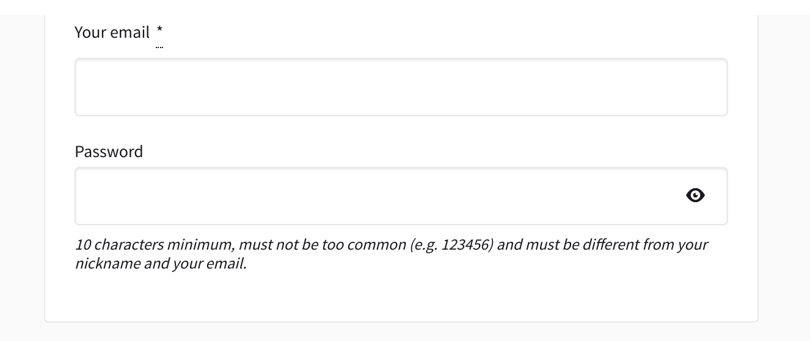

# Decidim::FriendlySignup

[![[CI] Lint](https://github.com/OpenSourcePolitics/decidim-module-friendly_signup/actions/workflows/lint.yml/badge.svg)](https://github.com/OpenSourcePolitics/decidim-module-friendly_signup/actions/workflows/lint.yml)
[![[CI] Test](https://github.com/OpenSourcePolitics/decidim-module-friendly_signup/actions/workflows/test.yml/badge.svg)](https://github.com/OpenSourcePolitics/decidim-module-friendly_signup/actions/workflows/test.yml)
[](https://codeclimate.com/github/OpenSourcePolitics/decidim-module-friendly_signup/maintainability)
[](https://codecov.io/gh/OpenSourcePolitics/decidim-module-friendly_signup)
[](https://badge.fury.io/rb/decidim-friendly_signup)

---

A more user friendly approach for the user registration process in [Decidim](https://github.com/decidim/decidim).

## Usage

This module simply substitutes some pages to ease up the registration process in Decidim.

### Features:

- [x] Simplify the password field and add a button with a "show password". 
 
- [ ] Remove the nickname field from the registration process and automatically create one on registering
- [ ] Instant validate parameters when registering without having to send it for backend validation
- [ ] Use checkout codes to validate the email instead of a link

## Installation

Add this line to your application's Gemfile:

```ruby
gem "decidim-friendly_signup"
```

For a bleeding edge version (or while developing) please use instead:

```ruby
gem "decidim-friendly_signup", git: "https://github.com/OpenSourcePolitics/decidim-module-friendly_signup", branch: "main"
```

And then execute:

```bash
bundle
```

**Note:**

The correct version of FriendlySignup should resolved automatically by the Bundler.
However you can force some specific version using `gem "decidim-friendly_signup", "~> 0.1.0"` in the Gemfile.

Depending on your Decidim version, choose the corresponding FriendlySignup version to ensure compatibility:

| FriendlySignup version | Compatible Decidim versions |
|---|---|
| 0.1.x | 0.26.x |

## Configuration

Customize your integration by creating an initializer (ie: `config/initializes/friendly_signup.rb`) and set some of the variables (you don't need to do this if you want all features enabled):

```ruby
# config/initializers/friendly_signup.rb

Decidim::FriendlySignup.configure do |config|
  # Override password views or leave the originals (default is true):
  config.override_passwords = false
end
```

## Contributing

Bug reports and pull requests are welcome on GitHub at https://github.com/OpenSourcePolitics/decidim-module-friendly_signup.

### Localization

If you would like to see this module in your own language, you can help with its
translation at Crowdin:

https://crowdin.com/project/decidim-friendly-signup

### Developing

To start contributing to this project, first:

- Install the basic dependencies (such as Ruby and PostgreSQL)
- Clone this repository

Decidim's main repository also provides a Docker configuration file if you
prefer to use Docker instead of installing the dependencies locally on your
machine.

You can create the development app by running the following commands after
cloning this project:

```bash
$ bundle
$ DATABASE_USERNAME=<username> DATABASE_PASSWORD=<password> bundle exec rake development_app
```

Note that the database user has to have rights to create and drop a database in
order to create the dummy test app database.

Then to test how the module works in Decidim, start the development server:

```bash
$ cd development_app
$ DATABASE_USERNAME=<username> DATABASE_PASSWORD=<password> bundle exec rails s
```

In case you are using [rbenv](https://github.com/rbenv/rbenv) and have the
[rbenv-vars](https://github.com/rbenv/rbenv-vars) plugin installed for it, you
can add the environment variables to the root directory of the project in a file
named `.rbenv-vars`. If these are defined for the environment, you can omit
defining these in the commands shown above.

#### Code Styling

Please follow the code styling defined by the different linters that ensure we
are all talking with the same language collaborating on the same project. This
project is set to follow the same rules that Decidim itself follows.

[Rubocop](https://rubocop.readthedocs.io/) linter is used for the Ruby language.

You can run the code styling checks by running the following commands from the
console:

```
$ bundle exec rubocop
```

To ease up following the style guide, you should install the plugin to your
favorite editor, such as:

- Sublime Text - [Sublime RuboCop](https://github.com/pderichs/sublime_rubocop)
- Visual Studio Code - [Rubocop for Visual Studio Code](https://github.com/misogi/vscode-ruby-rubocop)

### Testing

To run the tests run the following in the gem development path:

```bash
$ bundle
$ DATABASE_USERNAME=<username> DATABASE_PASSWORD=<password> bundle exec rake test_app
$ DATABASE_USERNAME=<username> DATABASE_PASSWORD=<password> bundle exec rspec
```

Note that the database user has to have rights to create and drop a database in
order to create the dummy test app database.

In case you are using [rbenv](https://github.com/rbenv/rbenv) and have the
[rbenv-vars](https://github.com/rbenv/rbenv-vars) plugin installed for it, you
can add these environment variables to the root directory of the project in a
file named `.rbenv-vars`. In this case, you can omit defining these in the
commands shown above.

### Test code coverage

Test coverage should be generated automatically in the folder "coverage" once any test is run:

```bash
$ bundle exec rspec
$ firefox coverage/index.html
```

## License

See [LICENSE-AGPLv3.txt](LICENSE-AGPLv3.txt).
